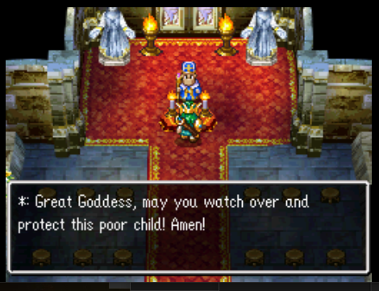
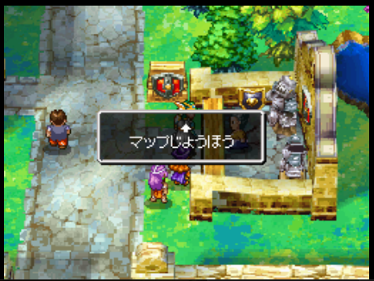

# Dragon Quest IV (NDS) English + Party Chat Script Patcher for Japan ROM

Patches English script files from the US version of Dragon Quest IV for Nintendo DS and Android so they are rendered nicely when used with the Japan ROM. Addresses various issues caused by the Japan game code being not fully compatible with English script files.

## Why?

The US version of Dragon Quest IV for the Nintendo DS did not have party chat (https://dragon-quest.org/wiki/Party_Chat) and seems to completely disable party chat in the game code, so it is not normally possible to play DQIV on DS with party chat in English. The Android version has English party chat script files that are compatible with the Japan ROM, but using English script files are not handled well by the Japan ROM code - among other things, control characters meant to be evaluated to switch between gendered pronouns and singular/plural words are not supported, so they render as literals instead of being evaluated. While it is technically possible to simply place the raw English script files as-is into the Japan ROM, these issues make it a subpar experience.

This patcher attempts to address those issues by replacing control character blocks with normal text, reflowing text so words are not split at the edge of the text box, and other tweaks to improve the overall experience. It is intended to allow a version of DQIV on DS with party chat, with a minimum of jank caused by the Japan ROM code not being meant for English text.

One potential approach that could provide an even better experience would be to alter the US version's code to re-enable party chat. In theory this would allow using the party chat files from the Android version as-is, without any script patching. Making this change is beyond my abilities and seems to require a nontrivial amount of code changes. If someone is able to do that it would make this script completely obsolete and me very happy.

## Prerequisites

Tools:
- Python 3
- dslazy (https://www.romhacking.net/utilities/793/)

Files:
- Nintendo DS Japan DQIV ROM
- From Nintendo DS US DQIV ROM: English `.mpt`. files located in `data/data/MESS/en` (153 files total)
    - Load the NDS US ROM in dslazy and unpack it. The unpacked files are in the `NDS_UNPACK` directory where your dslazy executable is.
    - An alternative is to use the same files from the Japan ROM. The US ROM contains updated script files that fixes some formatting issues (menu options are better named) and is preferred, but the Japan ROM files should work fine.
- From Android DQIV OBB: English Party Chat `.mpt` files - `b0500000.mpt` to `b0552000.mpt` (46 files total), located in `com.square_enix.android_googleplay.dq4/main.11100.com.square_enix.android_googleplay.dq4.obb/assets/msg/en`
    - After installing the Android DQIV app, you should be able to find the OBB by mounting your phone as a USB storage device and navigating to `Android/obb`. `.obb` files are basically zip files and can be extracted with any zip utility. You can rename the `.obb` file and change the extension to `.zip` to make extraction easier.
    - The Android OBB also includes the other non-party-chat `en` script files that may work instead of the US ROM files. However I ran into blackscreen issues when using these files on the JA ROM, so prefer using the NDS ones. YMMV 

## Quick Start

1. Download this patch tool by going to https://github.com/concreted/dqiv-nds-en-script-patcher/releases and downloading the latest version and unzip it. You can also clone this repo or download the repo as a zip.
1. Make sure there is an empty folder named `en` in the same directory as the `dqiv_patch.py` script file. If you cloned this repo/downloaded as a zip it should already be present, but if not create it.
1. Copy NDS US ROM `.mpt` files from the unpacked folder to the `en` directory. 
1. Copy Android OBB party chat `.mpt` files to the `en` directory
1. Run `python dqiv_patch.py`
1. Find output files in `out` directory. 
1. Load the JA ROM in dslazy and unpack it. Copy the contents of `out` to `<dslazy_directory>/NDS_UNPACK/data/data/mess`, replacing the folder of the same name (`en` if you ran with default settings).
1. Pack the ROM in dslazy. 

You have now generated a JA ROM with patched English script which includes party chat. This ROM will still use Japanese text by default, but can be switched to English with the Action Replay code `02106404 00000001`.

Alternatively, you can run `python dqiv_patch.py --lang ja` to generate a `ja` output folder. Copy this to the `<dslazy_directory>/NDS_UNPACK/data/data/mess` directory, replacing the `ja` folder, and pack the ROM is dslazy. This ROM will show the English script without requiring an Action Replay code. This version adds speaker names to the actual text - this is because the `ja` language mode does not show speaker names floating above the text box, instead expecting them to be in the actual text.

`en` language mode:  

`ja` language mode:  

There are several command line arguments available, run `python dqiv_patch.py -h` to see documentation. For example you can run the script with `--gender m` to generate a script with male gender pronouns, `--gender f` for female pronouns, or `--gender b` to include both.

## Comparison Screenshots

### Before
Using the raw English script files on a JA ROM:

### After
With patched script files:

## Approach

For each file:
- Seek until we find a `@a` start boundary. Write all bytes until the start boundary to the output file as-is.
- Next, seek until we find a `@b` nametag end boundary. Everything between `@a` and `@b` is the speaker name of the dialogue segment.
- Seek to `@c2@` end boundary. Determine length of segment.
- Remove each `%0` and add equal number of empty spaces at end of segment.
    - These appear to be used to selectively capitalize or add prefixes like "A `<word>`" where appropriate. Guess is that the JA ROM does not have code that supports this, so if not stripped the `%0` appears as-is in text.
- Find control segments and reduce them based on the following rules. Control segments can be nested so are recursively reduced.
    - Change each plural-variable block e.g. `%H***%Xyou%Yyouse%Z` to plural equivalent, padding end with spaces.
        - These cases appear to be handling player character events. 
        - Always pick the latter of the two options, since often there is more than one party member.
    - Change each plural-variable block e.g. `%M***%Xthem%Yit%Z` to singular equivalent, padding end with spaces.
        - These cases appear to be handling item-related events, e.g. "you can't use them/it". 
        - Always pick the latter of the two options (singular) because it sounds OK even when there is more than one item.
    - Change each context-specific block e.g. `%O***%Xthe girls'%Yyour%Z` to the first option.
        - These seem to be handling different cases when certain party members are present(?).
        - Use the second option since it seems to read fine in practice. 
    - Change each context-specific block e.g. `%L***%X<both sisters>%Y<one sister>%Z` to the second option.
        - These cases appear in dialogue where one or both sisters (Meena and Maya) can be present.
        - Pick the second case since it reads OK if both sisters are present.
    - Change each gender-variable block e.g. `%A***%Xsir%Z%B090%Xlady%Z` to gender-neutral equivalent, padding end with spaces. 
        - If no matching rule is found or only one option, warn and default to first item.
        - Rules:
            - his/her/its to their
            - he/she/* to they
            - man/woman to person
            - him/her/it to them
            - feen/wan to person
            - laddie/lassie to child
            - gent/wench to one
            - himself/herself/itself to themself
            - son/girl to `young one`
            - *sir/*lady to friend
            - *boy/*lady to `young one`
            - *ero/*eroine to warrior
            - *guy/*girl to person
            - monsieur/mademoiselle to friend
- Fix grammar issues caused by replacements, special case substitutions
    - Rules:
        - `they's` to `they are`
        - `What luck!` to `Found` - this makes the standard item discovery text flow better since we cannot use the `%0` control character to add the proper prefix.
- Re-layout line by first converting all newlines into spaces. Then split segments into lines with a max limit (usually 43) on space boundaries, changing spaces to newlines. There is a strange issue where the game auto-advances text boxes under certain conditions which can make the text box auto-advance to an empty screen. Because of this I remove newlines from end of each line, which seems to fix this issue without causing any other problems.
- Pad the segment to match the original segment's length.
- Repeat

Each resulting file should be the same size as the original. Each text segment should also be the exact same size as the original. The game expects text segments to start and end at specific places and resizing the text segments causes errors when the game tries to display text.

The file `b0801000.mpt` contains text used in battles. Battle text is rendered in a smaller font, so the normal 43-char line limit causes strange line splits in some places. Instead I reflow with line limit of 45 (this causes the enemy death text to flow better). 

Additionally, we apply a special patch to shorten chapter names in `b1007000.mpt`. The `en` chapter titles overflow the JA ROM chapter heading text boxes so are shortened. 

## Known issues

- Sometimes garbage characters like `%` may appear, which don't belong to control character segments. This can be caused by certain special characters that aren't handled correctly on the JA ROM. 
- Since we are forced to pick a single plural/singular substitution, sometimes the text will not have the correct plural/singular word choice.
- Since the max line size is fixed for the reflow logic, sometimes when item or monster names are substituted into text it will cause the line to exceed the max line size. This will cause the words to be split at the edge of the text box. I have added line-specific fixes to address this when I notice issues, and can do so for any reported cases.
- Enemy critical hits show `ACTOR` instead of the enemy name, probably because of some difference in the JA vs. EN ROM code causing the name substitution to break.
- Some text may overflow since the English script doesn't fix into text boxes expected for the JA ROM. Most obvious example is the chapter names on the save/load screen.
- When ROM language is changed to English, the name selection screen is still in Japanese, but the main character is always referred to as "Solo"/"Sophia" in game. This appears to be hardcoded in the JA ROM and I don't know how to fix this.
- When ROM language is set to Japanese (default), the game will still use the Japanese name selection screen and save/display the main character name in Japanese. Changing this seems to require changing the ROM code which I don't know how to do.
- Most item and enemy names are lowercased. The actual item strings are in lowercase, and the code to handle uppercasing them when appropriate doesn't seem to work in the JA ROM.  

- The map screen shows "Map Info" and other strings showing shop info in Japanese. Although the "Map Info" string is present in the `en` script files, the JA ROM seems to be hardcoded to show this string in Japanese. Replacing the corresponding file in the `ja` folder doesn't help. A few other strings are also affected in inventory screens, may be others I haven't found.  

- When there is more than one monster type in a battle, all monster names after the first one have `%0` prepended to them. This appears to be getting added in code, so is not possible to strip out by modifying the script data.
- When using `en` language mode, if there are multiple named speakers in one dialogue, the speaker nametag won't update correctly. For example if Maya is the first speaker and Meena responds in the same dialogue, the nametag will say Maya the whole time. This doesn't occur in `ja` language mode and this patch script is not altering the speaker names during patching, so this appears to be a code bug in the Japan ROM.
